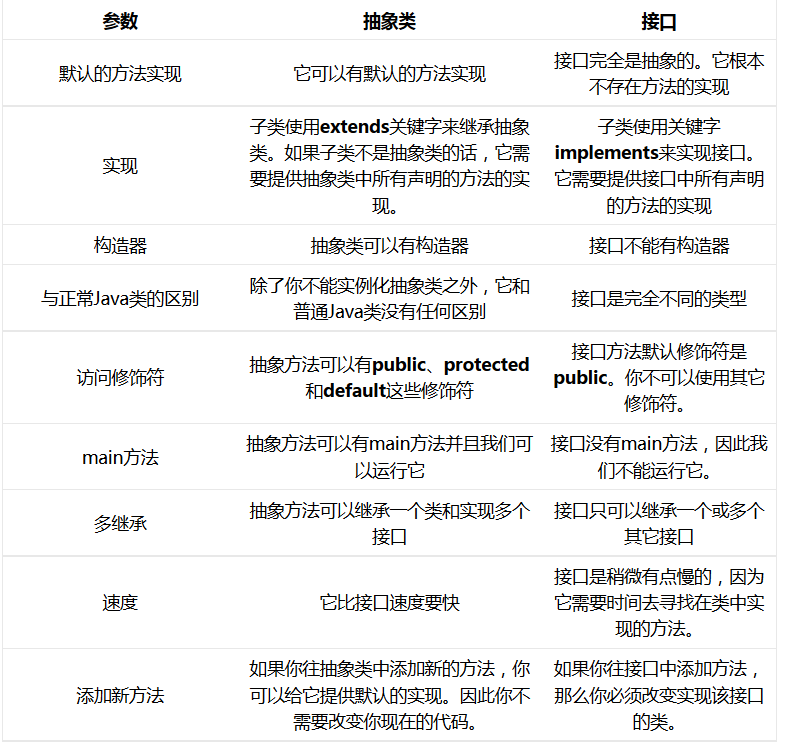

# Java学习/复习笔记

## Java内存空间
Java/JVM的内存空间主要有5个部分，线程私有的：Java虚拟机栈、程序计数器、本地方法栈。线程共享的：堆、方法区。

- **虚拟机栈(VM Stack)** :**方法的运行一定要在栈当中运行。**虚拟机栈也就是我们所说的栈内存，是java方法执行的内存模型。每个方法在执行的时候都会创建一个栈帧，用于存储局部变量表、操作数栈、动态链接、和方法返回地址等信息。局部变量表存储的是基本数据类型、returnAdress类型和对象引用。局部变量表的大小在编译期间完成分配，因此程序执行期间局部变量表的大小不会改变。操作数栈主要用来存储运算结果及运算的操作数。在数据结构中，栈最典型的一个应用就是用来对表达式求值。程序中的所有计算过程都是借助操作数栈完成的。每个栈帧都包含一个指向运行时常量池中该栈帧所属方法的引用，持有这个引用是为了支持方法调用中的动态链接就是将常量池中的符号引用在运行期间转化为直接引用。

- **本地方法栈(Native Method Stack)** :本地方法栈和虚拟机栈类似，只不过本地方法栈为虚拟机使用本地方法（native）服务。

- **程序计数器(P Register)** :程序计数器是当前线程所执行的行号指示器。通过改变计数器的值来确定下一条指令，比如循环，分支，跳转，异常处理，线程恢复等都依赖计数器来完成。在JVM规范中规定，如果线程执行的是非native方法，则程序计数器中保存的是当前需要执行的指令的地址；**如果线程执行的是native方法，则程序计数器中的值是undefind**。由于程序计数器中存储的数据所占空间的大小不会随程序的执行发生改变，因此，程序计数器是**不会发生内存溢出（OutOfMemory）现象**的。

- **堆(Heap)** :**凡是new出来的东西，都在堆当中。**java堆是所有线程共享的一块内存，在虚拟机启动是创建，几乎所有的对象实例都在这里创建，因此该区域经常发生**垃圾回收**。从内存回收的角度看，由于现在收集器基本都是采用**分代收集**算法，所以java堆中还可以细分为：新生代和老年代；新生代又分为Eden空间、From Survivor空间、To Survivor空间三部分。
      堆内存里面的东西都有一个地址值: 16进制
      堆内存里面的数据，都有默认值。规则:
          如果是整数     默认为0
          如果是浮点数   默认为0.0
          如果是字符     默认为'\u0000'
          如果是布尔     默认为false
          如果是引用类型  默认为null
  
- **方法区(Method Area) **:**存储.class相关信息，包含方法的信息**。方法区和java堆一样，是各个线程共享的内存区域，不需要连续的内存，并且可以动态扩展，动态扩展失败一样会抛出OutOfMemoryError异常。方法区用于存放已被虚拟机加载的类信息、常量、静态变量、即时编译器编译后的代码等数据。**虽然Java虚拟机规范把方法区描述为堆的一个逻辑部分，但是为了与java堆区分开，方法区又叫非堆（Non-Heap）,很多人更愿意把方法区称为“永久代”。**从jdk1.7已经开始准备“去永久代”的规划，jdk1.7的HotSpot中，已经把原来放在方法区中的静态变量，字符串常量池等移到堆内存中。在jdk1.8中，永久代已经不存在，存储的类信息、即时编译器编译后的代码等已经移动到元空间（MetaSpace）中，元空间并没有处于堆内存上，而是直接占用本地内存（NativeMemory）。

  ​        运行时常量池属于方法区的一部分（逻辑上，1.7以前放在永久带区域，1.8后物理存放在堆中，逻辑上在方法区），常量池中存放2类常量：字面量和符号引用。字面量比较接近java语言层面的常量概念，如文本字符串，被声明为final的常量值等。而符号引用则属于编译原理方面的概念，包括3类常量：类和接口的全限定名、字段的名称和描述符，方法的名称和描述符。

## Java多线程实现（四种方法）
https://zhuanlan.zhihu.com/p/47401636
-**1.继承Thread类，重写run方法（其实Thread类本身也实现了Runnable接口）**
每次创建一个新的线程，都要新建一个Thread子类的对象
启动线程，new Thread子类（）.start（）
创建线程实际调用的是父类Thread空参的构造器
-**2.实现Runnable接口，重写run方法**
不论创建多少个线程，只需要创建一个Runnable接口实现类的对象
启动线程，new Thread（Runnable接口实现类的对象）.start()
创建线程调用的是Thread类Runable类型参数的构造器
-**3.实现Callable接口，重写call方法（有返回值）**
自定义类实现Callable接口时，必须指定泛型，该泛型即返回值的类型
每次创建一个新的线程，都要创建一个新的Callable接口的实现类
（1）创建一个Callable接口的实现类的对象
（2）创建一个FutureTask对象，传入Callable类型的参数
```Java
public FutureTask(Callable<V> callable){……}
```
3）调用Thread类重载的参数为Runnable的构造器创建Thread对象
将FutureTask作为参数传递
```Java
public class FutureTask<V> implements RunnableFuture<V>
public interface RunnableFuture<V> extends Runnable, Future<V>
```
如何获取返回值？
调用FutureTask类的get()方法
-**4.使用线程池（有返回值）**

## 抽象类和接口的区别

**什么时候使用抽象类和接口**
- 如果你拥有一些方法并且想让它们中的一些有默认实现，那么使用抽象类吧。
- 如果你想实现多重继承，那么你必须使用接口。由于Java不支持多继承，子类不能够继承多个类，但可以实现多个接口。因此你就可以使用接口来解决它。
- 如果基本功能在不断改变，那么就需要使用抽象类。如果不断改变基本功能并且使用接口，那么就需要改变所有实现了该接口的类。

## new一个对象，jvm中的过程

## 深拷贝和浅拷贝
直接赋值引用不算拷贝
浅拷贝可以复制非引用型参数，但是引用型参数还是没有复制一份新的（继承Cloneable接口并重写clone方法）
深拷贝连引用型参数也完全拷贝一份，需要引用型参数本身的类也继承Cloneable接口并重写clone方法（依然继承Cloneable接口并重写clone方法 or clone方法里使用序列化和反序列化进行深拷贝但是要求其引用的对象本身支持序列化即继承Serializable接口）

## 字符串
-**字符串常量池**
只有直接双引号生成的字符串才在字符串池中，new的不在池子里
字符串常量池在**堆**中 

- *boolean String.equals(Object obj)*：比较两个字符串的内容是否**相同**
**(注：如果和常量字符串比较建议放在外面，不要放在括号里)** 
- *boolean String.equalsIgnoreCase(String str)*：比较两个字符串的内容是否相同**且忽略大小写**
- *String String.concat(String str)*：拼接两个字符串
- *int String.charAt(int index)*：获取指定索引处的字符
- *int String.indexOf(String str))*：查找参数字符串在本字符串中首次出现的索引位置，没有则返回-1
- *String String.substring(int index)*：截取从参数位置开始到结束的字符串
- *String String.substring(int begin,int end)*：截取从参数位置的字符串，左闭右开区间
- *char[ ] String.toCharArray(String)*：将当前字符串拆分成char数组
- *byte[ ] String.getBytes(String )*：将当前字符串拆分成byte数组
- *String String.replace(CharSequence string1,CharSequence string1)*：替换所有出现的字符串 
**(注：CharSequence是接口，可以接收字符串)**
- *String[ ] String.split(String regex)*：按照规则切分字符串**(注：regex是正则表达式)**

## static
- 如果一个成员变量使用了static关键字，那么这个变量不再属于对象自己，而是属于所在的类。**多个对象共享同一份数据。**
- 如果一个成员方法使用了static关键字，那么这个变量不再属于对象自己，而是属于所在的类。**对于静态方法来说，既可以通过对象名来调用方法，也可以通过类名来调用方法（建议用类名调用）。**
- 静态不可以访问非静态（**因为在内存中先有静态内容，后有非静态内容**）
- 静态里不可使用this关键字
- 静态代码块（在类中）：static｛｝静态代码块在第一次构造该类的时候只执行一次且有且执行一次。**典型用途：用来一次性地对成员变量进行赋值（尤其在使用JDBC时）**

## Arrays
- *String Arrays.toString(Arrays)*：将参数数组转换成字符串（默认格式[元素1,元素2,元素3....]）
- *void Arrays.sort(Arrays)*：将数组按照升序排序

  （**注：如果是数值，按照数值大小升序排序；如果是字符串，按照字母升序排序；如果是自定义类型，需要有Comparable或者Comparator接口的支持**）

## Math
- *double Math.abs(double num)*：绝对值
- *double Math.ceil(double num)*：向上取整
- *double Math.floor(double num)*：向下取整
- *long Math.round(double num)*：四舍五入

## 继承extends
- 局部变量: 直接写成员变量名
  本类的成员变量: this.成员变量名
  父类的成员变量: super.成员变量名
- super关键字：用来访问父类内容
 1.访问父类的成员变量
 2.访问父类的成员方法
 3.访问父类的构造方法
- this关键字：用来访问本类内容
 1.访问本类的成员变量
 2.访问本类的另一个成员方法（可省略）
 3.访问本类的另一个构造方法（**注：必须是构造方法的第一句，且用了this就不再调用super**）
- Java是**单继承**的（即只能有一个直接父类），但可以**多级继承**
- Java里最高级的父类是java.lang.Object

## 重写（Overload）
- *重写（Overload）*：继承关系里，方法名称和参数列表都**一样**
  *重载（Overload）*：继承关系里，方法名称一样，参数列表**不一样**
- 在重写方法前加上*@Override*可以检测是否重写有效
- 子类方法的返回值必须**小于等于**父类方法的返回值范围（即可以返回父类返回类型的子类）
- 子类方法的权限必须**大于等于**父类方法的权限修饰符（**注：public>protected>(default)>private**）
- 父类方法里已有的代码行可以直接通过super.XX（）在子类重写方法里使用
- **super的父类构造调用必须写在子类构造方法的第一句且只能调用一次**

## 抽象（abstract）
- 抽象方法：带有abstract修饰符且不具有方法体的方法
- 抽象类：带有abstract修饰符的类
- 不能直接new抽象类对象，需要用子类来继承，再创建子类对象
- 抽象类可以有构造方法，是供子类创建对象时，初始化父类成员使用的
- 抽象类不一定包含抽象方法，但**抽象方法所在的类必须是抽象类**
- 子类必须覆盖重写（实现）抽象父类中**所有的**抽象方法，除非子类也是抽象类

## 接口（interface）
- 接口是多个类的公共规范
- 接口是一种引用数据类型，最重要的是其中的抽象方法
- 接口的格式 *public interface 接口名字{//接口内容}*
- 接口可以包含的内容：
-            1.Java7可以有：常量、抽象方法
-            2.Java8增加了默认方法、静态方法
-            3.Java9增加了私有方法
- 在任何版本中，接口都可以定义抽象方法*public abstract 返回值类型 方法名称*