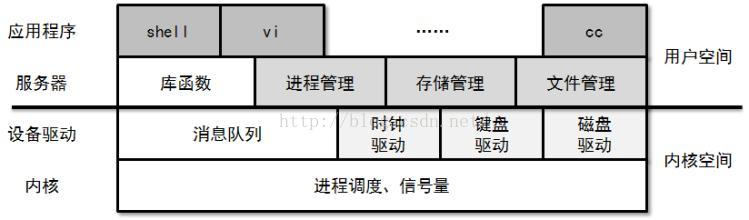

# 基础问答题笔记

https://www.cnblogs.com/zhang-qc/p/9410862.html 常见的网络面试题
https://www.nowcoder.com/discuss/271862?type=2 这个更全

## 计算机网络
- **TCP三次握手、四次挥手**
- **为什么是三次握手，两次可不可以？**
  因为保证可靠的最小传输的次数就是三次握手，A能发，B能收发，A能收，保证可靠，两次握手显然不可以，不仅不能保证可靠传输，可能导致失效的连接请求被服务端接收，A开始请求无效，后来重发请求成功和B通信，B后来又会和失效的A连接。
- **TCP如何保证可靠性?**
- **TIME_WAIT是什么阶段的？如果存在多个tcp请求处在这个阶段，会占用什么资源？有什么后果？**
  在进行关闭连接四次挥手协议时，最后的ACK是由主动关闭端发出的，如果这个最终的ACK丢失，服务器将重发最终的FIN，因此客户端必须维护状态信息允许它重发最终的ACK，这个等待时间就是TIME_WAIT。TIME_WAIT一般是2MSL（最长报文寿命），也就是4分钟。
  在**高并发短连接**的TCP服务器上，当服务器处理完请求后立刻主动正常关闭连接。这个场景下会出现大量socket处于TIME_WAIT状态。由于业务处理时间可能会远小于TIME_WAIT的时间，**如果客户端的并发量持续很高，会占用大量的端口资源，此时部分客户端就会显示连接不上，服务器因端口资源不足而拒绝为一部分客户服务**。
  解决办法简单来说，就是打开系统的TIMEWAIT重用和快速回收，例如复用TIMEWAIT的连接，或者减少TIMEWAIT的大小，开启快速回收。也可以通过负载均衡来对抗这些高并发的短请求，这样可以避免修改timewait造成的其他问题。（说个题外话，从这个意义出发来考虑服务器性能调优的话，长连接业务的服务就不需要考虑TIMEWAIT状态。同时，假如你对服务器业务场景非常熟悉，你会发现，在实际业务场景中，一般长连接对应的业务的并发量并不会很高。）
  https://www.cnblogs.com/dadonggg/p/8778318.html 参考的博客，写得还行
  
- **怎么解决SYN泛洪攻击？**
  
- **为什么建立连接是三次握手，关闭连接确是四次挥手呢？**
  建立连接的时候， 服务器在LISTEN状态下，收到建立连接请求的SYN报文后，把ACK和SYN放在一个报文里发送给客户端。 
  而关闭连接时，服务器收到对方的FIN报文时，仅仅表示对方不再发送数据了但是还能接收数据，而自己也未必全部数据都发送给对方了，所以己方可以立即关闭，也可以发送一些数据给对方后，再发送FIN报文给对方来表示同意现在关闭连接，因此，己方ACK和FIN一般都会分开发送，从而导致多了一次。
- **为什么TCP客户端最后还要发送一次确认呢？**
  一句话，主要防止已经失效的连接请求报文突然又传送到了服务器，从而产生错误。
  如果使用的是两次握手建立连接，假设有这样一种场景，客户端发送了第一个请求连接并且没有丢失，只是因为在网络结点中滞留的时间太长了，由于TCP的客户端迟迟没有收到确认报文，以为服务器没有收到，此时重新向服务器发送这条报文，此后客户端和服务器经过两次握手完成连接，传输数据，然后关闭连接。此时此前滞留的那一次请求连接，网络通畅了到达了服务器，这个报文本该是失效的，但是，两次握手的机制将会让客户端和服务器再次建立连接，这将导致不必要的错误和资源的浪费。
  如果采用的是三次握手，就算是那一次失效的报文传送过来了，服务端接受到了那条失效报文并且回复了确认报文，但是客户端不会再次发出确认。由于服务器收不到确认，就知道客户端并没有请求连接。
- **如果已经建立了连接，但是客户端突然出现故障了怎么办？**
  TCP还设有一个保活计时器，显然，客户端如果出现故障，服务器不能一直等下去，白白浪费资源。服务器每收到一次客户端的请求后都会重新复位这个计时器，时间通常是设置为2小时，若两小时还没有收到客户端的任何数据，服务器就会发送一个探测报文段，以后每隔75分钟发送一次。若一连发送10个探测报文仍然没反应，服务器就认为客户端出了故障，接着就关闭连接。
- **TCP长连接和短连接**
  短连接：建立连接——数据传输——关闭连接...建立连接——数据传输——关闭连接
  长连接：建立连接——数据传输...（保持连接）...数据传输——关闭连接
  而像WEB网站的http服务一般都用短链接，因为长连接对于服务端来说会耗费一定的资源，而像WEB网站这么频繁的成千上万甚至上亿客户端的连接用短连接会更省一些资源，如果用长连接，而且同时有成千上万的用户，如果每个用户都占用一个连接的话，那可想而知吧。所以并发量大，但每个用户无需频繁操作情况下需用短连好。
- https://blog.csdn.net/u014465934/article/details/89202797
- **TCP和UDP的区别**
  1.TCP 是面向连接的传输层协议，应用程序在使用 TCP 协议之前，必须先建立 TCP 连接，传输数据完后，需要释放 TCP 连接。UDP 是无连接的，发送数据之前不需要建立连接，因此减少了开销和发送数据的时延。
  2.2.每一条 TCP 连接只能有两个端点，所以 TCP 连接是点对点的。UDP 支持一对一，一对多，多对一和多对多的相互通信。
  3.TCP 提供可靠交互的服务，通过 TCP 连接传送的数据，无差错，不丢失，不重复，按序到达。UDP 使用尽最大努力交付，即不保证交付可靠。
  4.TCP 是面向字节流的，TCP 把应用程序交下来的数据看成仅仅是一连串无结构的字节流，TCP 不关心把多长的报文发送到缓存中，而是根据对方给出的窗口和网络拥塞程度来决定一个报文段应包含多少个字节。UDP 是面向报文的，UDP 对应用层交下来的报文既不合并也不拆分，一次交付一个完整的报文。
  5.TCP 有拥塞控制，UDP 没有拥塞控制，很多实时应用（IP电话，视频会议等），要求主机恒定速率发送数据，并且允许在拥塞的时候丢失数据，所以很适合 UDP。
  6.UDP 首部开销小，只有8个字节。TCP 首部 20 个字节。
  7.TCP 提供全双工通信，允许通信双方在任何时候发送数据，TCP 连接两端都有发送缓存和接收缓存。
- **TCP的可靠传输的工作原理**
a.停止等待协议/超时重传
  停止等待就是每发完一个分组，就停止发送，等待对方的确认，在收到确认后再发送下一个分组。
  如果超过一段时间没有收到确认，就认为刚才发送的分组丢失了，因而重传刚发发送的分组，这就叫做超时重传。
  超时重传时间应当比数据在分组传输的平均往返时间更长一点。
  上述这种可靠传输协议被称为自动重传请求 ARQ（Automatic Repeat-reQuest）。
b.流水线传输
  停止等待协议的优点是简单，但是信道利用率太低了。解决方法是采用连续ARQ协议，流水线传输使用的就是连续 ARQ 协议和滑动窗口协议。
  首先，位于发送窗口内的分组都可以连续的发送出去，而不需要等待对方的确认。当所有的分组都发送出去以后，根据连续 ARQ 协议规定，发送方每接收到一个确认，就可以把发送窗口向前移动一个分组的位置。
  接收方一般都是采用累积确认的方式。也就是说接收方不必对收到的分组逐个发送确认。而是在收到几个分组后，对按序到达的最后一个分组发送确认（前面的小组都要检查，但是只是对所有OK的分组中最后一个返回确认，这样就可以节省时间了）。如果收到了这个分组确认信息，则表示到这个分组为止的所有分组都已经正确接收到了。
  规则：（1）凡是已经发送过的数据，在未收到确认之前，都必须暂时保留，以便在超时重传时使用。（2）只有当发送方A收到了接收方的确认报文段时，发送方窗口才可以向前滑动几个序号。（3）当发送方A发送的数据经过一段时间没有收到确认（由超时计时器控制），就要使用回退N步协议，回到最后接收到确认号的地方，重新发送这部分数据。
- **TCP的流量控制**
  原理这就是运用TCP报文段中的窗口大小字段来控制，发送方的发送窗口不可以大于接收方发回的窗口大小。
  TCP为每一个连接设有一个持续计时器(persistence timer)。只要TCP连接的一方收到对方的零窗口通知，就启动持续计时器。若持续计时器设置的时间到期，就发送一个零窗口控测报文段（携1字节的数据），那么收到这个报文段的一方就重新设置持续计时器。
- **TCP的拥塞控制**
  拥塞控制的四种算法，即慢开始（Slow-start)，拥塞避免（Congestion Avoidance)，快重传（Fast Restrangsmit)和快回复（Fast Recovery）
  发送方维持一个拥塞窗口 cwnd ( congestion window )的状态变量。拥塞窗口的大小取决于网络的拥塞程度，并且动态地在变化。发送方让自己的发送窗口等于拥塞。
  发送方控制拥塞窗口的原则是：只要网络没有出现拥塞，拥塞窗口就再增大一些，以便把更多的分组发送出去。但只要网络出现拥塞，拥塞窗口就减小一些，以减少注入到网络中的分组数。
  **慢开始算法**：即**由小到大逐渐增大发送窗口**，也就是说，由小到大逐渐增大拥塞窗口数值。通常在刚刚开始发送报文段时，先把拥塞窗口 cwnd 设置为一个最大报文段MSS的数值。而在每收到一个对新的报文段的确认后，把拥塞窗口增加至多一个MSS的数值。用这样的方法逐步增大发送方的拥塞窗口 cwnd ，可以使分组注入到网络的速率更加合理。每经过一个传输轮次，拥塞窗口 cwnd 就加倍。
  为了防止拥塞窗口cwnd增长过大引起网络拥塞，还需要设置一个慢开始门限ssthresh状态变量（如何设置ssthresh）。慢开始门限ssthresh的用法如下：
1.当 cwnd < ssthresh 时，使用上述的慢开始算法。
2.当 cwnd > ssthresh 时，停止使用慢开始算法而改用拥塞避免算法。
3.当 cwnd = ssthresh 时，既可使用慢开始算法，也可使用拥塞控制避免算法。
  **拥塞避免算法**：让拥塞窗口cwnd缓慢地增大，即每经过一个往返时间RTT就把发送方的拥塞窗口cwnd加1，而不是加倍。这样拥塞窗口cwnd按线性规律缓慢增长，比慢开始算法的拥塞窗口增长速率缓慢得多。
  无论在慢开始阶段还是在拥塞避免阶段，只要发送方判断网络出现拥塞（其根据就是没有收到确认），就要把慢开始门限ssthresh设置为出现拥塞时的发送方窗口值的一半（但不能小于2）。然后把拥塞窗口cwnd重新设置为1，执行慢开始算法。
  **快重传算法**：首先要求接收方每收到一个失序的报文段后就立即发出重复确认（为的是使发送方及早知道有报文段没有到达对方）而不要等到自己发送数据时才进行捎带确认。(如果当发送端接收到**三个重复的确认ACK**时，则断定分组丢失，立即重传丢失的报文段，而不必等待重传计时器超时)
  **快恢复算法**：1.当发送方连续收到三个重复确认，就执行“乘法减小”算法，把慢开始门限ssthresh减半。这是为了预防网络发生拥塞。请注意：接下去不执行慢开始算法。
2.由于发送方现在认为网络很可能没有发生拥塞，因此与慢开始不同之处是现在不执行慢开始算法（即拥塞窗口cwnd现在不设置为1），而是把cwnd值设置为慢开始门限ssthresh减半后的数值，然后开始执行拥塞避免算法（“加法增大”），使拥塞窗口缓慢地线性增大。
- **HTTP有哪些函数？**
- **HTTP和HTTPS的区别**
  HTTP协议传输的数据都是未加密的，也就是明文的，因此使用HTTP协议传输隐私信息非常不安全，为了保证这些隐私数据能加密传输，于是网景公司设计了SSL（Secure Sockets Layer）协议用于对HTTP协议传输的数据进行加密，从而就诞生了HTTPS。简单来说，HTTPS协议是由SSL+HTTP协议构建的可进行加密传输、身份认证的网络协议，要比http协议安全。
  HTTPS和HTTP的区别主要如下：
　　1、https协议需要到ca申请证书，一般免费证书较少，因而需要一定费用。
　　2、http是超文本传输协议，信息是明文传输，https则是具有安全性的ssl加密传输协议。
　　3、http和https使用的是完全不同的连接方式，用的端口也不一样，前者是80，后者是443。
　　4、http的连接很简单，是无状态的；HTTPS协议是由SSL+HTTP协议构建的可进行加密传输、身份认证的网络协议，比http协议安全。
  HTTPS的优点：
   （1）使用HTTPS协议可认证用户和服务器，确保数据发送到正确的客户机和服务器；
   （2）HTTPS协议是由SSL+HTTP协议构建的可进行加密传输、身份认证的网络协议，要比http协议安全，可防止数据在传输过程中不被窃取、改变，确保数据的完整性。
   （3）HTTPS是现行架构下最安全的解决方案，虽然不是绝对安全，但它大幅增加了中间人攻击的成本。
  HTTPS的缺点：
   （1）HTTPS协议握手阶段比较费时，会使页面的加载时间延长近50%，增加10%到20%的耗电；
   （2）HTTPS连接缓存不如HTTP高效，会增加数据开销和功耗，甚至已有的安全措施也会因此而受到影响；
   （3）SSL证书需要钱，功能越强大的证书费用越高，个人网站、小网站没有必要一般不会用。
   （4）SSL证书通常需要绑定IP，不能在同一IP上绑定多个域名，IPv4资源不可能支撑这个消耗。
   （5）HTTPS协议的加密范围也比较有限，在黑客攻击、拒绝服务攻击、服务器劫持等方面几乎起不到什么作用。最关键的，SSL证书的信用链体系并不安全，特别是在某些国家可以控制CA根证书的情况下，中间人攻击一样可行。
- HTTP 请求方法。
- 列举 HTTP 状态码
  1XX：通知
  2XX：成功   200("OK")
  3XX：重定向   304("Not Modified")
  4XX：客户端错误   400("Bad Request")   403("Forbidden")    404("Not Found")
  5XX：服务端错误   502("Bad Gateway")
- **HTTP和TCP中的keep_alive**
  HTTP中叫做“Keep-Alive”, 是为了连接复用，即减少多余的TCP请求
  TCP中叫做“KeepAlive”，是为了保证连接是健康的，如即时通讯技术需要用到
- **HTTP的连接复用/多路复用**
  https://www.cnblogs.com/zl1991/p/12918229.html 对比了1.1、2的连接复用
  https://segmentfault.com/a/1190000011172823 详细说了HTTP2的多路复用
  简而言之，1.1的keepalive只是复用了单个连接，还是有顺序问题，2里是整个整个域名下的都基于一个链接，采用帧和流进行传输，通过序列标识在传输后进行拼装。
- **ping操作用到了哪些协议？**
  UDP ICMP ARP OSPF
  具体过程是：首先进程在应用层发起一个IP的ping请求，传输层接收到请求，将其加上udp的头部，转发到IP层，IP层根据ICMP 协议进行封装，添加源IP和目标IP封装成为数据包，然后转到链路层，链路层接收到数据包，进行封装对应的mac地址，调用ARP协议，查询ARP缓存表，没有找到则广播出去，寻找对应IP的mac地址，这个过程用到了路由的协议OSPF。
  

## 操作系统OS
- **进程和线程有什么区别？线程共享哪些东西？**
- **用户态和内核态有什么区别，为什么要在两者间切换？**
  内核态与用户态是操作系统的两种运行级别，当程序运行在3级特权级上时，就可以称之为运行在用户态。因为这是最低特权级，是普通的用户进程运行的特权级，大部分用户直接面对的程序都是运行在用户态；当程序运行在0级特权级上时，就可以称之为运行在内核态。
  运行在用户态下的程序不能直接访问操作系统内核数据结构和程序。当我们在系统中执行一个程序时，大部分时间是运行在用户态下的，在其需要操作系统帮助完成某些它没有权力和能力完成的工作时就会切换到内核态（比如操作硬件）。
  这两种状态的主要差别是：处于用户态执行时，进程所能访问的内存空间和对象受到限制，其所处于占有的处理器是可被抢占的。处于内核态执行时，则能访问所有的内存空间和对象，且所占有的处理器是不允许被抢占的。
  导致用户态到内核态的切换主要有三种情况：
  1.系统调用（主动）
  这是用户态进程主动要求切换到内核态的一种方式，用户态进程通过系统调用申请使用操作系统提供的服务程序完成工作。比如前例中fork()实际上就是执行了一个创建新进程的系统调用。而系统调用的机制其核心还是使用了操作系统为用户特别开放的一个中断来实现，例如Linux的int 80h中断。用户程序通常调用库函数，由库函数再调用系统调用，因此有的库函数会使用户程序进入内核态（只要库函数中某处调用了系统调用），有的则不会。**常见的系统调用有进程创建与销毁，内存分配与释放，文件的读写，获取或设置系统的日期时间等等。**
  2.异常（被动）
  当CPU在执行运行在用户态下的程序时，发生了某些事先不可知的异常，这时会触发由当前运行进程切换到处理此异常的内核相关程序中，也就转到了内核态，比如缺页异常。
  3.外围设备的中断（被动）
  当外围设备完成用户请求的操作后，会向CPU发出相应的中断信号，这时CPU会暂停执行下一条即将要执行的指令转而去执行与中断信号对应的处理程序，如果先前执行的指令是用户态下的程序，那么这个转换的过程自然也就发生了由用户态到内核态的切换。比如硬盘读写操作完成，系统会切换到硬盘读写的中断处理程序中执行后续操作等。
  内核态与用户态之间的切换是发生在一个线程中的。
  https://blog.csdn.net/hahachenchen789/article/details/79934208
  一般现代CPU都有几种不同的指令执行级别。**在高执行级别下，代码可以执行特权指令，访问任意的物理地址，这种CPU执行级别就对应着内核态。而在相应的低级别执行状态下，代码的掌控范围会受到限制。只能在对应级别允许的范围内活动。**

https://blog.csdn.net/qq_29996285/article/details/88078906?utm_medium=distribute.pc_relevant.none-task-blog-BlogCommendFromMachineLearnPai2-1.nonecase&depth_1-utm_source=distribute.pc_relevant.none-task-blog-BlogCommendFromMachineLearnPai2-1.nonecase

  **用户态切换到内核态的唯一途径——>中断/异常/陷入**
  **内核态切换到用户态的途径——>设置程序状态字**
  CS寄存器的低两位决定了当前CPU的特权等级，即RPL字段。
  CS的全拼为“Code segment”，即代码段寄存器，对应于内存中的存放代码的内存区域，用来存放内存代码段区域的入口地址（段基址）。CPU在执行指令时，通过代码寄存器CS和指令指针寄存器IP（instruction Pointer）来确定要执行的下一条指令的内存地址。**CS:IP 两个寄存器指示了CPU当前要读取的指令地址，计算方式一般为CS左移4位然后加上IP寄存器，作为地址去取内容。**
- **几个寄存器的区别，PC、IR、CS：IP**
  指令寄存器（IR）：，用于暂存当前正在执行的指令。
  数据缓冲寄存器（DR）：
  程序计数器（PC）：用于存放下一条指令所在单元的地址的地方。
  地址寄存器（AR）：
  累加寄存器（AC）：
  状态条件寄存器（PSW）：保存由算术指令和逻辑指令运行或测试的结果建立的各种条件码内容。
  CS:IP见上条
  取指令阶段完成的任务是将现行指令从主存中取出来并送至指令寄存器中，具体的操作如下： [5] 
1、将程序计数器（PC）中的内容送至存储器地址寄存器（MAR），并送地址总线（AB）。
2、由控制单元（CU）经控制总线（CB）向存储器发读命令。
3、从主存中取出的指令通过数据总线（DB）送到存储器数据寄存器（MDR） 。
4、将MDR的内容送至指令寄存器（IR）中 。
5、将PC的内容递增，为取下一条指令做好准备 。
- **内存查看、虚拟内存和物理内存**
  top、ps aux、cat proc/meminfo等
  top里有VIRT（虚拟内存）、RES（物理内存）、SHR（共享内存）
  ps里有VSZ（虚拟内存）、RSS（物理内存）
  
  计算机会对虚拟内存地址空间（32位为4G）分页产生页（page），对物理内存地址空间（假设256M）分页产生页帧（page frame），这个页和页帧的大小是一样大的，所以呢，在这里，虚拟内存页的个数势必要大于物理内存页帧的个数。在计算机上有一个页表（page table），就是映射虚拟内存页到物理内存页的，更确切的说是页号到页帧号的映射，而且是一对一的映射。但是问题来了，虚拟内存页的个数 > 物理内存页帧的个数，岂不是有些虚拟内存页的地址永远没有对应的物理内存地址空间？不是的，操作系统是这样处理的。操作系统有个页面失效（page fault）功能。操作系统找到一个最少使用的页帧，让他失效，并把它写入磁盘，随后把需要访问的页放到页帧中，并修改页表中的映射，这样就保证所有的页都有被调度的可能了。这就是处理虚拟内存地址到物理内存的步骤。
  虚拟内存地址由页号（与页表中的页号关联）和偏移量组成。页号就不必解释了，上面已经说了，页号对应的映射到一个页帧。那么，说说偏移量。偏移量就是我上面说的页（或者页帧）的大小，即这个页（或者页帧）到底能存多少数据。举个例子，有一个虚拟地址它的页号是4，偏移量是20，那么他的寻址过程是这样的：首先到页表中找到页号4对应的页帧号（比如为8），如果页不在内存中，则用失效机制调入页，否则把页帧号和偏移量传给MMU（CPU的内存管理单元）组成一个物理上真正存在的地址，接着就是访问物理内存中的数据了。总结起来说，虚拟内存地址的大小是与地址总线位数相关，物理内存地址的大小跟物理内存条的容量相关。
  32位操作系统能够支持的内存是2的32次方，相当于4GB内存。相对来说，64位操作系统支持的内存大小是2的64次方，相当于128GB内存，支持最大16TB虚拟内存。按照物理内存的最小两倍最大8倍计算。1位运算处理器支持256M内存。32位os＝8192M虚拟内存（也就是8G）64位=16TB(64*256M＝16384MB）＝16TB
  
- **进程间的通信方式有哪些？**
  IPC：进程间通信（interprocess communication）
  1.**管道( pipe )**：管道包括三种:普通管道PIPE： 通常有两种限制,一是单工,只能单向传输;二是只能在父子或者兄弟进程间使用。流管道s_pipe: 去除了第一种限制,为半双工，只能在父子或兄弟进程间使用，可以双向传输。命名管道:name_pipe：去除了第二种限制,可以在许多并不相关的进程之间进行通讯.
  2.**信号量( semophore ) **：信号量是一个计数器，可以用来控制多个进程对共享资源的访问。它常作为一种锁机制，防止某进程正在访问共享资源时，其他进程也访问该资源。因此，主要作为进程间以及同一进程内不同线程之间的同步手段。
  3.**消息队列( message queue ) **：消息队列是由消息的链表，存放在内核中并由消息队列标识符标识。消息队列克服了信号传递信息少、管道只能承载无格式字节流以及缓冲区大小受限等缺点。
  4.**信号 ( sinal )** ：信号是一种比较复杂的通信方式，用于通知接收进程某个事件已经发生。
  5.**共享内存( shared memory ) **：共享内存就是映射一段能被其他进程所访问的内存，这段共享内存由一个进程创建，但多个进程都可以访问。共享内存是最快的 IPC 方式，它是针对其他进程间通信方式运行效率低而专门设计的。它往往与其他通信机制，如信号两，配合使用，来实现进程间的同步和通信。
  6.**套接字( socket ) **：套解口也是一种进程间通信机制，与其他通信机制不同的是，它可用于不同机器间的进程通信。
  https://www.cnblogs.com/liugh-wait/p/8533003.html 具体介绍看这里

## 数据库/mysql/Mongo
- ACID
  原子性：事务是访问和更新数据库的程序执行的最小的单元，事务中可能包含一个或多个sql语句，这些语句要么都执行，要么都不执行，是作为一个整体的。
  一致性：事务执行前后，数据库的完整性是一致的，包括主键，表的结构，字段的类型、长度，以及例如转账后A+B余额不能改变，这些都是一致性追求的东西。
  隔离性：不同的事务在并发执行的时候不能互相干扰，尤其是读和写的操作上。
  持久性：事务执行成功以后，对数据库的操作影响是持续有效的，结果是持久化的。
- 锁机制：
  锁机制的基本原理可以概括为：事务在修改数据之前，需要先获得相应的锁；获得锁之后，事务便可以修改数据；该事务操作期间，这部分数据是锁定的，其他事务如果需要修改数据，需要等待当前事务提交或回滚后释放锁。
- 读操作可能引起的问题
  （1）脏读：当前事务(A)中可以读到其他事务(B)未提交的数据（脏数据），这种现象是脏读。
  （2）不可重复读：在事务A中先后两次读取同一个数据，两次读取的结果不一样，这种现象称为不可重复读。脏读与不可重复读的区别在于：前者读到的是其他事务未提交的数据，后者读到的是其他事务已提交的数据。
  （3）幻读：在事务A中按照某个条件先后两次查询数据库，两次查询结果的条数不同，这种现象称为幻读。不可重复读与幻读的区别可以通俗的理解为：前者是数据变了，后者是数据的行数变了。
- SQL的隔离机制（从低到高）
  读未提交
  读已提交
  可重复读
  可串行化
  大多数数据库系统中，默认的隔离级别是读已提交(如Oracle)或可重复读（后文简称RR，如InnoDB）
  InnoDB解决的方法：（1）读脏：读的时候检查是否已提交，没有的话读最新数据并回滚。（2）不可重复读：第一次读的时候记录版本号，发现版本号不一致的时候同样回滚。（3）幻读：对读取的所有行都记录版本号，发现版本号不一致的时候同样回滚。
  在mongoDB里：多文档的事务操作在4.0版本开始支持，但只支持副本集，4.2开始支持分布式事务操作。
   （1）开始事务之前需要创建会话，比如python版本：
```python
  with client.start_session() as s:
　　s.start_transaction()
　　collection_one.insert_one(doc_one, session=s)
　　collection_two.insert_one(doc_two, session=s)
　　s.commit_transaction()
```
   （2）当两个(或多个)并发事务修改相同的文档时，会发生冲突。即使在尚未提交事务时，MongoDB也可以立即检测到冲突。当在执行创建索引时，未加{background:1}后台创建。
此时新事务将无法获取所需的锁，并且在等待参数maxTransactionLockRequestTimeoutMillis后事务终止回滚，默认值是5毫秒。
   （3）MongoDB采用的默认隔离级别是Snapshot一致性快照(特别是设置了readConcern=majority情况下，要读某行数据的历史版本时，依赖该隔离级别。)
Snapshot介于Repeatable Read与Serializable之间，既避免了脏读、不可重复读、幻读，又不会因Serializable串行化降低并发性能。
   （4）原子性：针对多文档的事务操作，MongoDB 提供 "All or nothing" 的原子语义保证。隔离性：MongoDB 提供 snapshot 隔离级别，在事务开始创建一个 WiredTiger snapshot，然后在整个事务过程中使用这个快照提供事务读。持久性：事务使用 WriteConcern {j: ture} 时，MongoDB 一定会保证事务日志提交才返回，即使发生 crash，MongoDB 也能根据事务日志来恢复;而如果没有指定 {j: true} 级别，即使事务提交成功了，在 crash recovery 之后，事务的也可能被回滚掉。
   （5）mongo在读写的时候会加锁，所以对同文档的修改是不会出现问题的，但是mongodb在分片和复制集的时候会产生脏读，后面在研究。
- Mongo的语句优化
- 在NoSQL中，通常有两个层次的一致性：第一种是强一致性，既集群中的所有机器状态同步保持一致。第二种是最终一致性，既可以允许短暂的数据不一致，但数据最终会保持一致。我们先来讲一下，在分布式集群中，为什么最终一致性通常是更合理的选择，然后再来讨论两种一致性的具体实现结节。
- CAP
一致性（C）：在分布式系统中的所有数据备份，在同一时刻是否同样的值。
可用性（A）：在集群中一部分节点故障后，集群整体是否还能响应客户端的读写请求。
分区容忍性（P）：集群中的某些节点在无法联系后，集群整体是否还能继续进行服务。
在分布式存储系统中，最多只能实现上面的两点。
- MongoDB ACID 多文档事务支持
|事务属性|支持程度|
|-|-|
|Atomocity 原子性|单表单文档 ： 1.x 就支持<br/>复制集多表多行：4.0 复制集<br/>分片集群多表多行4.2|
|Consistency 一致性|writeConcern, readConcern (3.2)|
|Isolation 隔离性|readConcern (3.2)|
|Durability 持久性|Journal and Replication|
- 什么是 writeConcern ？
  writeConcern 决定一个写操作落到多少个节点上才算成功。writeConcern 的取值包括：
• 0：发起写操作，不关心是否成功；
• 1~集群最大数据节点数：写操作需要被复制到指定节点数才算成功；默认是1。
• majority：写操作需要被复制到大多数节点上才算成功。
• all：写入所有节点才算成功。
发起写操作的程序将阻塞到写操作到达指定的节点数为止
  
- j:true
  writeConcern 可以决定写操作到达多少个节点才算成功，journal 则定义如何才算成
功。取值包括：
• true: 写操作落到 journal 文件中才算成功；
• false: 写操作到达内存即算作成功。
数据库数据写入的顺序  数据在内存中先写日志文件（journal 中落地持久化日志文件），再写数据文件
  
- readPreference与readConcern
  readPreference 设置 分布式数据库从哪里读
  readConcern 什么样的数据可以读
  
- Mongo的切片

- Mongo索引

  Mongo用的B树，mysql用的是B+树，具体https://www.cnblogs.com/rjzheng/p/12316685.html


## 面试题
- 1、假设淘宝一天有5亿条成交数据，求出销量最高的100个商品并给出算法的时间复杂度。
  第一题先用hash统计，然后维护一个堆求top100，总的时间复杂度是O(n)+O(mlg100)吧，m是不重复商品总数.....
- 2、给一列无序数组，求出中位数并给出算法的时间复杂度。
  线性算法/分治
  用分治策略（类似快排），O(n)的复杂度
- 3、输入一个整型数组，求出子数组和的最大值，并给出算法的时间复杂度。
  DP
- 4、给出10W条人和人之间的朋友关系，求出这些朋友关系中有多少个朋友圈(如A-B、 B-C、D-E、E-F， 这4对关系中存在两个朋友圈)，并给出算法的时间复杂度。
  并查集
- 5、如图所示的数字三角形，从顶部出发，在每一结点可以选择向左走或得向右走，一直走到底
层，要求找出一条路径，使路径上的值的和最大。给出算法的时间复杂度。
  DP
- 6、有一个很长二进制串，求出除以3的余数是多少，给出算法的时间复杂度。
  DFA

## Python
- **python的装饰器是什么？**
  装饰器用来封装一个函数，并且用这样或者那样的方式来修改它的行为，增加函数可以做的事情。
```python
def a_new_decorator(a_func):

    def wrapTheFunction():
        print("I am doing some boring work before executing a_func()")

        a_func()
         
        print("I am doing some boring work after executing a_func()")

    return wrapTheFunction

def a_function_requiring_decoration():
    print("I am the function which needs some decoration to remove my foul smell")

a_function_requiring_decoration()
#outputs: "I am the function which needs some decoration to remove my foul smell"

a_function_requiring_decoration = a_new_decorator(a_function_requiring_decoration)
#now a_function_requiring_decoration is wrapped by wrapTheFunction()

a_function_requiring_decoration()
#outputs:I am doing some boring work before executing a_func()
#        I am the function which needs some decoration to remove my foul smell
#        I am doing some boring work after executing a_func()
```
- **都说python比其他语言慢，为什么？怎么加快**
  编译语言和解释语言，从本质上来说就是完全不同的：编译语言能最终直接对应到机器码。C/C++是典型的编译语言。有JIT的解释语言和真·解释语言，从实现上来说完全不同：JIT可以通过技术手段将解释语言进行重新整理，变成适合编译的结构，然后再转换成机器码，得到接近于编译语言的性能。典型的JIT语言是Java、Javascript同样是解释语言，抽象层次低的语言会比抽象层次高的语言实现起来更容易，运行也更快，典型的如Lua。
  Python比 C++执行效率低是多种原因交织在一起的原因。我觉得关键问题是 动态类型、解释执行、虚拟机、GIL这四个方面的问题：1、为了支持动态类型，Python对象加入了很多抽象，执行的时候要不断的判断数据类型，带来很大的开销2、python代码由解释器逐条解释执行（interactive model）或每次执行都要先翻译再运行，运行效率大大降低。3、虚拟机带来间接开销，而且Python的虚拟机cpython性也不如jvm。4、GIL带来的伪多线程问题，所以python大力发展协程和异步语法C++是直接编译成可执行二进制代码，有系统原生的进程、线程加持，没有动态类型的开销，没有虚拟机的开销，如果没有使用虚函数、虚继承等特性，C++代码能获得C语言一样的效率。同样运行在虚拟机上的java，编译成字节码再执行，效率就高多了，重IO的场景与C++相比也不遑多让。Python的另一个解释器PyPy引入了JIT、多线程等，执行效率蹭蹭的就上去了。
  Python 主要几个性能损失点：大量使用堆分配内存、无处不在的引用计数、支持各种动态类型、对象行为自定义导致的各种函数调用、当然还有解释执行。
  一篇比较好的博客https://blog.csdn.net/june_young_fan/article/details/83547759 里面几方面原因都说到了。**既有GIL的原因，也有动态解释语言的原因，也有编译器的原因。**
  PyPy使用了明显快于CPython的JIT。JIT本身不会使执行速度加快，因为它执行的仍然是同样的字节码序列。但是JIT会允许在运行时进行优化。
  https://www.jianshu.com/p/7792a332ca98 
- **Python里\*和\**有什么区别?**

- **__开头的函数你知道哪些**
  以下划线开头的标识符是有特殊意义的。以单下划线开头 _foo 的代表不能直接访问的类属性，需通过类提供的接口进行访问，不能用 from xxx import * 而导入。
  以双下划线开头的 __foo 代表类的私有成员，以双下划线开头和结尾的 __foo__ 代表 Python 里特殊方法专用的标识，如 __init__() 代表类的构造函数。
  __dir__()：列出对象的所有属性（方法）名
  __dict__：字典形式保存的对象里面的所有属性以及属性值（包括私有属性）
  https://blog.csdn.net/weixin_44252534/article/details/86485197 详细的这里有一些
  
  


- **全局解释其锁Global Interpreter Lock(GIL)**

- **如果我退出了当前程序，是不是其他人就访问不到了？你确定吗？如果要的话要怎么办？**

https://zhuanlan.zhihu.com/p/142147342 python的一些面试题


## 其他

- **快速排序**
  一个比较简单的快排的python写法
```python
	def quickSort(array):
    if len(array) < 2:
        return array
    else:
        pivot = array[0]
        less = [i for i in array[1:] if i < pivot]
        greater = [j for j in array[1:] if j >= pivot]
        return quickSort(less) + [pivot] + quickSort(greater)
print quickSort([1,5,5,2,6,9,3])
```
- **快速排序的优化**
  a. 优化枢轴点选取方式：即尽量选取较为中间大小的元素作为中枢点pivot，例如
   1.三数取中，选三个数（也可以更多）作为样本，取其中位数作为枢轴点，这样划分更均衡。
   2.直接找到中位数作枢轴点。选取中位数的可以在 O(n)时间内完成。
  b. 三分序列
   经典快排分成大于枢轴和小于枢轴两堆，而遇到等于枢轴的元素时根据具体实现不同全部在枢轴左边或右边。所以才会导致元素全部一样时退化到O（n^2）的问题。所以改进方法是在分区的时候，将序列分为 3 堆，一堆小于中轴元素，一堆等于中轴元素，一堆大于中轴元。次递归调用快速排序的时候，只需对小于和大于中轴元素的两堆数据进行排序。
  c. 小数组变插入排序
   为什么当数据很少时要用插排呢？其实有时候当规模较小时分治算法效率是不如普通算法的。插入排序中包含的常数因子较小，使得当 n 较小时,算法运行得更快。因此,当数组递归子序列的规模在一个固定阀值(阀值指数组的最大长度)以下时,采用插入排序对子序列进行排序,能够缩短排序时间。一般阀值选取在 7到10 个元素，我记得Java里的Arrays.sort()方法好像是用的7个元素（当元素是基本类型时sort用的是优化版快排，当元素是对象时用的是归并排序，因为对于对象需要稳定性）。
  d. 多线程快排
   这块不了解，就明说吧
- **排序相关的面试题**
  https://www.jianshu.com/p/591bfbbd2661
- **排序算法的比较**
排序法 | 最差时间分析 | 平均时间复杂度 | 稳定度 | 空间复杂度
-|-|-|-|-
冒泡排序 | O(n^2) | O(n^2) | 稳定 | O(1)
快速排序 | O(n^2) | O(n*log2n) | 不稳定 | O(log2n)~O(n)
选择排序 | O(n^2) | O(n^2) | 不稳定 | O(1)
二叉树排序 | O(n^2) | O(n*log2n) | 不一定 |O(n)
插入排序 | O(n^2) | O(n^2) | 稳定 | O(1)
堆排序 | O(n*log2n) | O(n*log2n) | 不稳定 | O(1)
希尔排序 | O(n^2) | O(n^1.3) | 不稳定 | O(1)
归并排序 | O(n*log2n)  | O(n*log2n) | 稳定 |O(1)
- **post和get有什么区别？**
  1.两者都是明文传送，但是GET的URL会被放在浏览器历史和WEB服务器日志里面，POST 发完基本就木有了，从这点上说post比get安全一些。但是被抓包的情况下两者都不安全。
  2.可以重复的交互，比如取个数据，跳个页面， 用GET。不可以重复的操作， 比如创建一个条目/修改一条记录，用POST，因为POST不能被缓存，所以浏览器不会多次提交。
  3.get表达的是一种幂等的，只读的，纯粹的操作，即它除了返回结果不应该会产生其它副作用(如写数据库)，因此绝大部分get请求(通常超过90%)都直接被CDN缓存了，这能大大减少web服
务器的负担。而post所表达的语义是非幂等的，有副作用的操作，所以必须交由web服务器处理。
  4.GET请求会显示请求指定的资源。一般来说GET方法应该只用于数据的读取，而不应当用于会产生副作用的非幂等的操作中。POST请求会 向指定资源提交数据，请求服务器进行处理，如：表单数据提交、文件上传等，请求数据会被包含在请求体中。POST方法是非幂等的方法，因为这个请求可能会创建新的资源或/和修改现有资源。

## 数据结构
- B树和B+树的区别？B+树又什么优点
